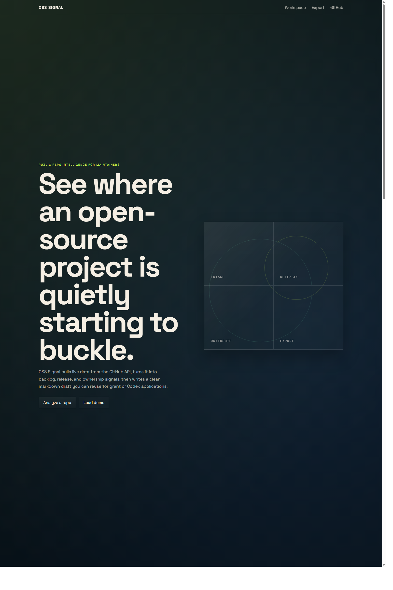

# OSS Signal

[](https://github.com/TOOOOOOBY-Q/oss-signal/actions/workflows/ci.yml)
[](https://tooooooby-q.github.io/oss-signal/)
[](./LICENSE)

OSS Signal is a polished, zero-build dashboard for public GitHub repositories. It surfaces maintainer pressure from live GitHub API data, highlights stale issues and stalled PRs, maps contributor concentration, and exports a clean markdown draft for grant or Codex-style applications.

The app is static HTML, CSS, and JavaScript, so it is easy to publish with GitHub Pages.

Created by TOOOOOOBY.

[Live demo](https://tooooooby-q.github.io/oss-signal/) | [Repository](https://github.com/TOOOOOOBY-Q/oss-signal)



## Why it hits

- It solves a real maintainer pain point instead of wrapping another model endpoint.
- It looks like a real product, not a throwaway dashboard.
- It is static and easy to fork, review, publish, and demo from GitHub Pages.
- It exports something useful immediately: a maintainer-facing Codex or grant application draft.

## Why this project is worth shipping

- It solves a real open-source maintainer problem instead of being another generic AI wrapper.
- It looks strong enough to stand on its own as a public demo project.
- It works directly in the browser with no backend, database, or build step.
- It can analyze any public GitHub repo and export a reusable markdown summary.

## Features

- Live GitHub API fetch for repo metadata, issues, pull requests, releases, contributors, and recent commits
- Paginated backlog fetch across up to 300 oldest open issues and 300 oldest open pull requests for better signal on larger repos
- Attention score that estimates backlog and ownership pressure
- Triage lanes for "respond now", "schedule next", and "healthy flow"
- Release cadence summary with recent tagged releases
- Contributor concentration bars for quick bus-factor-style scanning
- Markdown export for Codex or grant application drafts
- Optional personal access token input for higher GitHub API rate limits, stored only for the current tab session
- Shareable deep links with `?repo=owner/repo`

## Quick start

1. Clone or download this repository.
2. Bootstrap the local development environment.

```powershell
cd C:\oss-signal
powershell -ExecutionPolicy Bypass -File .\scripts\bootstrap-dev.ps1
```

3. Start the local dev server.

```powershell
powershell -ExecutionPolicy Bypass -File .\scripts\dev.ps1
```

4. Open [http://127.0.0.1:8080](http://127.0.0.1:8080).
5. Enter any public repository in `owner/repo` format, or paste a GitHub repository URL.

You can also deploy the folder directly to GitHub Pages.

## Development

- `scripts/install-python-env.ps1`: install Python on a fresh Windows machine
- `scripts/bootstrap-dev.ps1`: create `.venv` and install dev dependencies
- `scripts/dev.ps1`: run the local static server
- `scripts/check.ps1`: run lint and smoke tests

Run the checks before pushing:

```powershell
powershell -ExecutionPolicy Bypass -File .\scripts\check.ps1
```

## GitHub Pages deploy

1. Create a new GitHub repository.
2. Push this folder to the default branch.
3. In GitHub, open `Settings -> Pages`.
4. Set the source to `Deploy from a branch`.
5. Select your default branch and `/ (root)`.

## Suggested repo pitch

If you want this project to help an application, pitch it honestly:

- open-source maintainers lose time to triage, review, and release coordination
- OSS Signal makes that workload visible with no setup
- the tool pairs naturally with Codex because it turns messy repo operations into concrete queues and drafts

## Notes

- Unauthenticated GitHub API requests are rate-limited. Add a token in the UI if you plan to demo multiple repositories.
- The token is kept in `sessionStorage`, not long-term browser storage, so it clears when the tab closes.
- GitHub contributor stats are a useful signal, not a perfect measure of maintainership.
- If a project has no releases, the release cadence section will say so instead of inventing a story.
- Some very large repositories are analyzed as a bounded sample of the oldest open backlog items so the app stays fast in GitHub Pages.

## License

MIT
